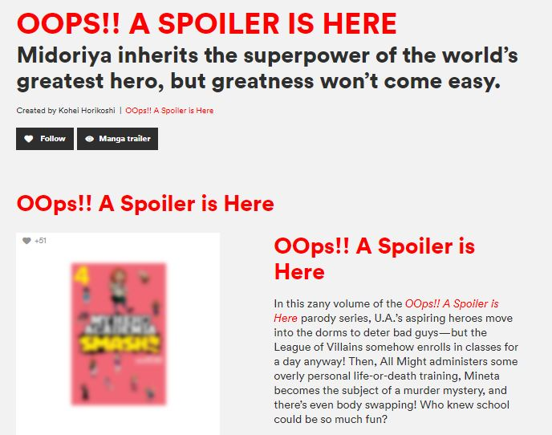

# MyHeroAcademia-ChromeExtension
Extension Handles MHA spoilers 

# :sparkles: My Hero Academima : Spoiler detector - Chrome Extension  

This Extension hides all the spoiler related stuff and images also 

This the first time I have tried to make an Extension and it turned out to be very easy and fun activity. 

## Sample  

## Functionality
-*Blocks Spoiler and replaces with a "OOPS Spoiler message"
-*Blurs out images that potentially contain spoilers
-*Open Source
-*Fully customizable

## Usage
-Clone or download this repository
-Open Google Chrome then go to "chrome://extensions"
-Click on "Load Unpacked"
-Select the folder where the repository has been downloaded
-That's all....You are ready to go

##Your contribution is necessary.Why?
-This is a very basic extension and can be modifies to a lot of extent
-Also this will help me learn more

## BUG
-I have observed that some websites may load slower when this extension is enabled
-Not a very big issue but I would appreciate the help

